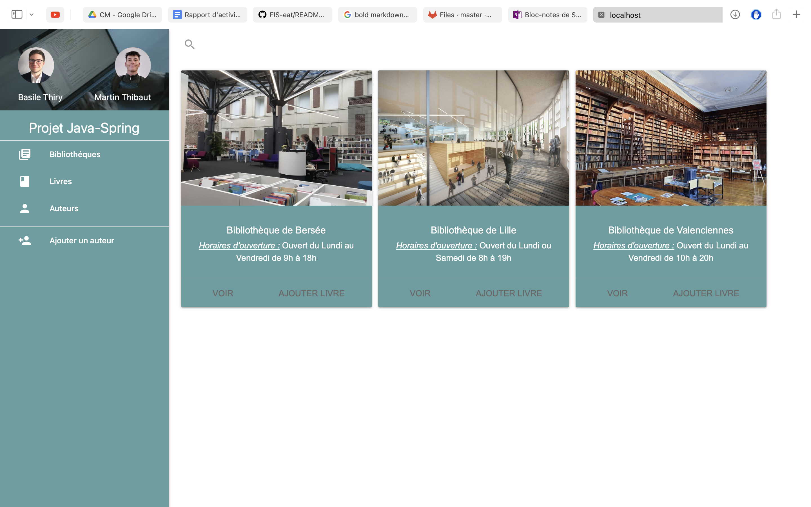
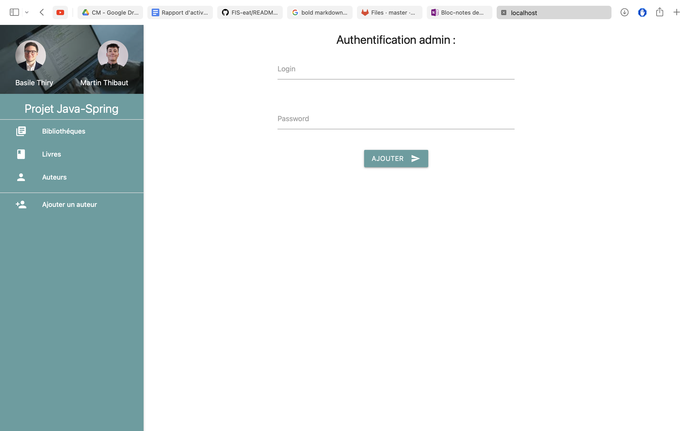

# Projet Java Spring

## Build and Run

### *Prerequisites*

````bash
git clone https://github.com/maaart1/FISA3-bibliotheque_java_spring.git
````

**Don't forget to go in master branch. Not in main branch.**

### *Start HiberNate* 

*-- IN THE FIRST TERMINAL --*

*1. You need to go in the hsqldb folder*
```bash
cd hsqlbd/lib
```

*2. Run the HiberNate application*
```bash
java -jar hsqldb.jar
```

*3. Run the bqt database with this line*
```bash
java -cp hsqldb.jar org.hsqldb.server.Server --database.0 file:mydb --dbname.0 bqt
```

*4. Connect the database*

In driver case, enter : `org.hsqldb.jdbc.JDBCDriver`

In URL case, enter : `jdbc:hsqldb:hsql://localhost/bqt`

User : `SA`

PassWord : 

*5. Add data in the database*

In PostMan : 
- Copy the content file called *data.json* in react-app.
- In PostMan, use *AddDataInProject* and paste in the body.
- Clic on Send button.

If you have an message like : 
```json
{
  "message": "Data is loaded :)"
}
````
It's ok :)


*6. Add at least one user*
In PostMan :
- Use *addUtilisateur* and add user in the form of :
```json
{
  "login": "login_utlisateur",
  "password": "password_utilisateur"
}
```


### *Start the api*
After [Prerequisites section](#prerequisites), you can do this :

*-- IN THE SECOND TERMINAL --*

*1. Open the project with IntelliJ*

*2. Run the main function in BibliothequeProjetApplication class*

### *Start the react application* 
After [Prerequisites section](#prerequisites), you can do this : 

*-- IN THE THIRD TERMINAL --*

*1. Go in the project*
```bash
cd bibliotheque-insa-java-spring/
```

*2. Go in the react app*
```bash
cd react-app/
```

*3. Don't forget to run this line*
```bash
npm install
```

*4. Run the react app*
```bash
npm start
```

**Enjoy ;)**

## Somes pictures






